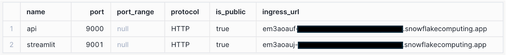

# GLM-4V-9B
GLM-4V–9B is an open-source model from the latest GLM-4 series developed by Zhipu AI. This model excels in dialogue capabilities in both Chinese and English with a high resolution of 1120x1120. It outperforms other models, such as GPT-4-turbo-2024–04–09, Gemini 1.0 Pro, Qwen-VL-Max, and Claude 3 Opus, in various multimodal evaluations.  

These evaluations encompass a wide range of abilities, including proficiency in Chinese and English, perception and reasoning, text recognition, and chart understanding. Additionally, this generation of models supports 26 languages, including Japanese, Korean, and German, enhancing its multilingual capabilities.

Repository on Hugging Face 🤗:  
[THUDM/glm-4v-9b](https://huggingface.co/THUDM/glm-4v-9b/blob/main/README_en.md)

### Minimum Requirements
* 1x GPU_NV_S (1x NVIDIA A10G)

We are utilizing quantization by setting `quantization_config = BitsAndBytesConfig(load_in_4bit=True)`  to reduce memory and computational costs by representing weights and activations with lower-precision data types.
This config enables 4-bit quantization by replacing the Linear layers with FP4/NF4 layers from bitsandbytes. 
Without this flag, this model would not fit on a single NVIDIA A10G.

### 1. Run the General Setup
Make sure that you created all required databse objects from the general setup instructions [here](https://github.com/michaelgorkow/scs_llm_zoo/blob/main/README.md).

### 2. Build & Upload the container
```cmd
docker build build --platform linux/amd64 -t <ORGNAME>-<ACCTNAME>.registry.snowflakecomputing.com/llm_db/public/image_repository/glm_4v_9b_service:latest .  

docker push <ORGNAME>-<ACCTNAME>.registry.snowflakecomputing.com/llm_db/public/image_repository/glm_4v_9b_service:latest
```

### 3. Upload the Service Specification
You can use Snowflake's UI to upload the glm_4v_9b_spec.yml to @LLM_DB.PUBLIC.CONTAINER_FILES.  

### 4. Create the LLM Service
```sql
-- Create LLM service
CREATE SERVICE LLM_DB.PUBLIC.GLM_V4_9B_SERVICE
  IN COMPUTE POOL LLM_GPU_POOL_SMALL
  FROM @LLM_DB.PUBLIC.CONTAINER_FILES
  SPEC='glm_4v_9b_spec.yml'
  MIN_INSTANCES=1
  MAX_INSTANCES=1
  EXTERNAL_ACCESS_INTEGRATIONS = (LLM_ACCESS_INTEGRATION);

-- Verify Service is running
SELECT SYSTEM$GET_SERVICE_STATUS('GLM_V4_9B_SERVICE');
-- View Service Logs
SELECT SYSTEM$GET_SERVICE_LOGS('GLM_V4_9B_SERVICE',0,'glm-4v-9b-service-container');
```

### 5. Create the service function
```sql
-- Create the Service Function
CREATE OR REPLACE FUNCTION LLM_DB.PUBLIC.GLM_V4_9B(PAYLOAD OBJECT)
RETURNS OBJECT
SERVICE=LLM_DB.PUBLIC.GLM_V4_9B_SERVICE
ENDPOINT=API
AS '/complete';
```

### 6. Call the service functions
```sql
-- Test function in SQL with pure text
SELECT object_construct('prompt','Write a small poem about the company Snowflake.',
                        'args',object_construct(
                            'generation_args',object_construct(
                                'max_length',2500,
                                'top_p',0.8
                            )
                        )
        ) AS LLM_QUERY,
        GLM_V4_9B(LLM_QUERY)['LLM_OUTPUT_TEXT']::TEXT AS LLM_RESPONSE;

-- Test function in SQL with Images from a Snowflake Stage
SELECT RELATIVE_PATH, 
       object_construct('prompt','Describe this image',
                        'args',object_construct(
                            'file_url',GET_PRESIGNED_URL('@IMAGE_FILES', RELATIVE_PATH),
                            'stream',FALSE,
                            'return_image_base64',FALSE,
                            'generation_args',object_construct(
                                'max_length',2500,
                                'top_p',0.8
                            )
                        )
        ) AS LLM_QUERY,
        GLM_V4_9B(LLM_QUERY)['LLM_OUTPUT_TEXT']::TEXT AS LLM_RESPONSE
FROM DIRECTORY('@IMAGE_FILES') LIMIT 1;
```

### 7. Streamlit Apps
The container will host a Streamlit App which can be accessed from anywhere. You can even open it from your mobile phone and upload an image from your camera.
To get the endpoint, run this command:  
```sql
SHOW ENDPOINTS IN SERVICE LLM_DB.PUBLIC.GLM_V4_9B_SERVICE;
```

You should see these two endpoints and their corresponding URLs:  


Open the ingress-URL for streamlit in any browser, login to your Snowflake account and you can start chatting with the LLM from any device.  

The same Streamlit code that runs in the container can also run in Streamlit in Snowflake (SiS). However, there are a couple of limitations: Service Functions do not support streamed responses, and it is not yet possible to authenticate to the Service via OAuth in SiS. Therefore, you cannot enable streamed responses.
To get the Streamlit app up and running in Snowflake, simply copy the code into a new Streamlit app within Snowflake.

### 8. Demo
